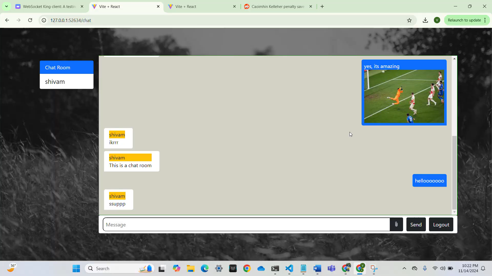

# Real-Time Chat Application with Kubernetes and Vertical Pod Autoscaling

## Overview
This project represents a real-time chat application designed for seamless communication. It leverages the power of modern frameworks and tools, integrating Kubernetes for orchestration and Vertical Pod Autoscaling (VPA) to optimize resource utilization dynamically.

The backend is built using **Spring Boot**, facilitating robust server-side logic, while the frontend is crafted with **React**, ensuring an intuitive user interface. Real-time communication is enabled using **SockJS**.

## Key Features

- **User Authentication**: Secure login functionality to manage user access.
- **Real-Time Messaging**: Enables users to exchange messages instantly in a chatroom.
- **User Presence Tracking**: Notifications inform users when others join or leave the chatroom.
- **Private Messaging**: Allows users to send direct messages to specific participants.
- **Media Sharing**: Supports the exchange of multimedia content, including images and videos.
- **Logout Feature**: Ensures a smooth and secure logout experience.
- **Resource Optimization**: Kubernetes orchestrates deployments, while VPA automatically adjusts resources based on load.

## Technology Stack

### Backend
- **Spring Boot**: Handles server-side processing and business logic.
- **SockJS**: Provides WebSocket emulation for real-time communication.

### Frontend
- **React**: Builds the user interface for a responsive user experience.

### Containerization and Orchestration
- **Docker**: Containers the application components for portability.
- **Kubernetes**: Manages the deployment, scaling, and availability of application resources.

### Autoscaling
- **Vertical Pod Autoscaler (VPA)**: Dynamically adjusts the CPU and memory allocation for pods to ensure optimal performance.

## Setup Instructions

### Local Development Setup

#### Backend
1. Clone the repository:
   ```
   git clone https://github.com/ojasvisharma04/Vertical_Pod_Autoscaling_Kubernetes.git
   ```
2. Navigate to the backend directory:
   ```
   cd chatroom-backend
   ```
3. Install dependencies and start the backend server:
   ```
   mvn clean install
   mvn spring-boot:run
   ```

#### Frontend
1. Navigate to the frontend directory:
   ```
   cd chatroom-ui
   ```
2. Install dependencies and start the React development server:
   ```
   npm install
   npm run dev
   ```
3. Access the application at:
   ```
   http://localhost:5173
   ```

### Building and Pushing Docker Images to DockerHub

1. Build Docker images for both frontend and backend:
   - Backend:
     ```
     docker build -t your-dockerhub-username/chatroom-backend .
     ```
   - Frontend:
     ```
     docker build -t your-dockerhub-username/chatroom-ui .
     ```

2. Log in to DockerHub:
   ```
   docker login
   ```

3. Push the images to DockerHub:
   - Backend:
     ```
     docker push your-dockerhub-username/chatroom-backend
     ```
   - Frontend:
     ```
     docker push your-dockerhub-username/chatroom-ui
     ```

### Kubernetes Deployment

#### Prerequisites
- **Minikube** or any Kubernetes cluster setup
- **Kubectl** for cluster management

#### Steps to Deploy
1. Apply the backend deployment and service configurations:
   ```
   kubectl apply -f backend-deployment.yaml
   kubectl apply -f backend-service.yaml
   ```
2. Apply the frontend deployment and service configurations:
   ```
   kubectl apply -f frontend-deployment.yaml
   kubectl apply -f frontend-service.yaml
   ```
3. Deploy the Vertical Pod Autoscaler (VPA) for backend and frontend pods:
   ```
   kubectl apply -f backend-vpa.yaml
   kubectl apply -f frontend-vpa.yaml
   ```

#### Exposing Services with Minikube
To access the application via Minikube, expose the services:

- **Frontend**:
  ```
  minikube service chatroom-ui --url
  ```

- **Backend**:
  ```
  kubectl port-forward svc/chatroom-backend 8080:8080
  ```

### Verification
Check the status of your pods and VPA configuration:

1. Verify pod status:
   ```
   kubectl get pods
   ```

2. Inspect VPA settings:
   ```
   kubectl describe vpa chatroom-backend-vpa
   kubectl describe vpa chatroom-ui-vpa
   ```

## Screenshots
- **Login Page**: 
  
  

- **Chatroom**:   

  

- **Multimedia support**: 

  

- **Private chat**: 

  


